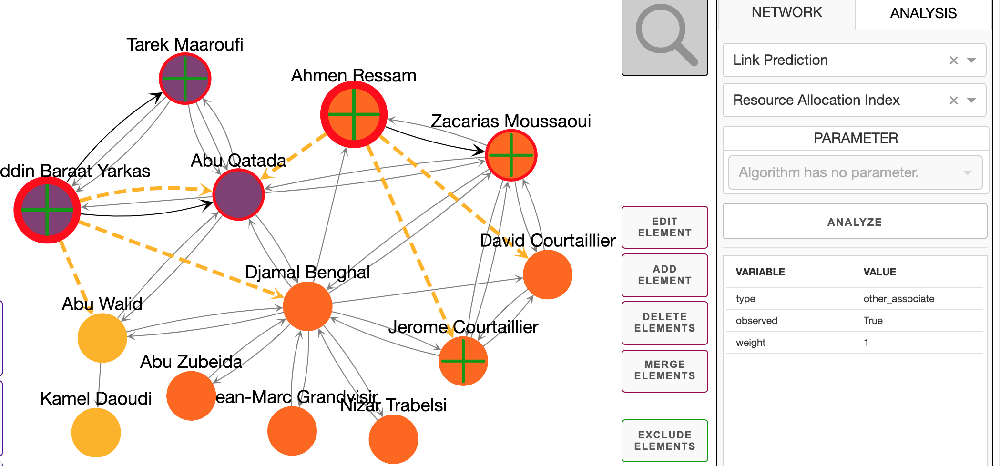

# Criminal Network Analysis and Visualization

[](https://www.python.org/)
[](https://networkx.org/)
[](https://opensource.org/licenses/MIT)

[](https://github.com/erichoang/criminal-network-visualization)

A visualization tool for criminal network analysis.

- analyzer: criminal (social) network analysis functionalities, including community detection, social influence analysis, node embedding generation, and (transductive) link prediction.
- datasets: criminal datasets for developing/testing the system. [[List of Criminal Datasets]](datasets/preprocessed/README.md).
- conductor: providing API services
- framework: the system's infrastructure/framework and communication among its components
- storage: data handling graph storage 
- tester: example scripts for testing the system's components
- visualizer: web interfaces and visualization. [[Visualizer User Documentation]](https://github.com/erichoang/criminal-network-visualization/blob/main/visualizer/documentation/visualizer_doc.md).

This repository is a part of the paper "Inductive and Transductive Link Prediction for Criminal Network Analysis," published in the Journal of Computational Science in 2023. The paper discusses how identifying potential offenders who might co-offend can help law enforcement focus their investigations and improve predictive policing. Traditional methods rely heavily on manual work by police officers, which can be inefficient. To address this, the paper introduces two machine learning frameworks based on graph theory, specifically for burglary cases. These are transductive link prediction (this repository), which predicts connections between existing nodes (offenders or cases), and inductive link prediction (see the implementation [here](https://github.com/erichoang/criminal-link-prediction)), which finds links between new cases and existing nodes.

## Citation
 Ahmadi, Z., Nguyen, H. H., Zhang, Z., Bozhkov, D., Kudenko, D., Jofre, M., Calderoni, F., Cohen, N., & Solewicz, Y. (2023). Inductive and transductive link prediction for criminal network analysis. Journal of Computational Science. [Preprint](https://hoanghnguyen.com/assets/pdf/ahmadi2023inductive.pdf)
```
@article{ahmadi2023inductive,
  title = {Inductive and Transductive Link Prediction for Criminal Network Analysis},
  author = {Ahmadi, Zahra and Nguyen, Hoang H. and Zhang, Zijian and Bozhkov, Dmytro and Kudenko, Daniel and Jofre, Maria and Calderoni, Francesco and Cohen, Noa and Solewicz, Yosef},
  journal = {Journal of Computational Science},
  publisher = {Elsevier},
  volume = {72},
  pages = {102063},
  year = {2023},
  issn = {1877-7503},
  doi = {https://doi.org/10.1016/j.jocs.2023.102063},
  url = {https://www.sciencedirect.com/science/article/pii/S1877750323001230},
}
```

# Analysis and Visualization
## Installation
### Requirements
- Linux
- Anaconda

### Install Environment

Install python required packages.
```bash
pip install -r visualizer/requirements.txt
```

## Quickstart

### Run the server

Start the server by executing the `index.py` with Python 3.7:  

````bash
$ python index.py
````

### Open the visualizer

The server now listens locally on port 8050. Click the link provided by the command line interface or visit `0.0.0.0:8050` directly.

### Visualizer User Documentation
For a full tutorial on how to use our visualizer, please check the [Visualizer User Documentation](https://github.com/erichoang/criminal-network-visualization/blob/main/visualizer/documentation/visualizer_doc.md).
